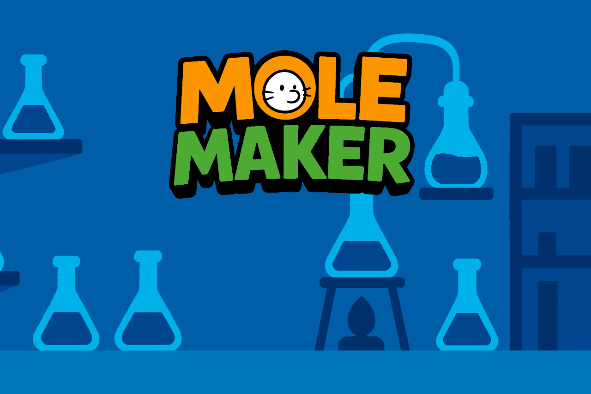
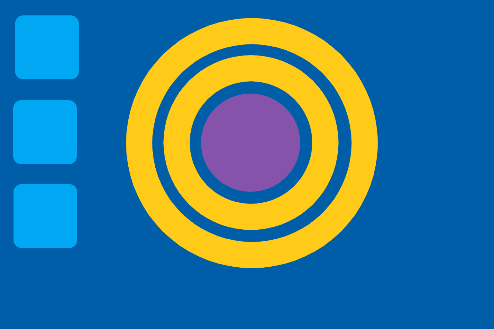
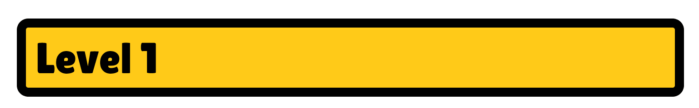
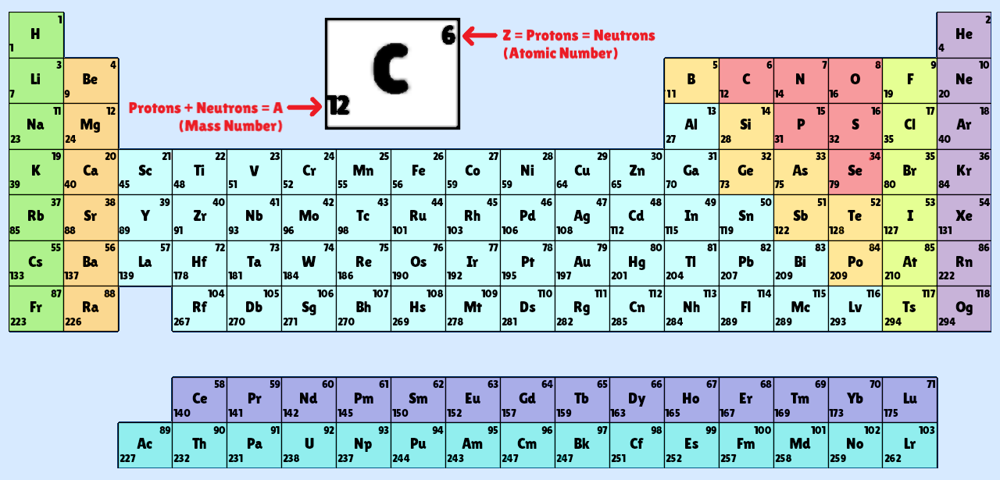

# Mole Maker

[](https://godotengine.org/)
A molecule-building puzzler created for the **MIT CMS.590 Design and Development of Games for Learning** class.

[Play the latest build on itch.io](https://kbrought.itch.io/mole-maker)

## Screenshots






## Features

- Build molecules by assembling protons, neutrons, and electrons into atoms.
- Interactive periodic table and lab systems that encourage experimentation.
- **Designed levels and tutorial systems to align with Next Generation Science Standards (NGSS)** for middle and high school chemistry education, including structure and properties of matter (MS-PS1, HS-PS1).
- Original art and sound effects housed in the [assets](assets/) directory.

## Build & Run

1. Install [Godot 4.4](https://godotengine.org/).
2. Open `project.godot` in the Godot editor.
3. Press <kbd>F5</kbd> to play or use the **Export** menu to build for your platform.

From the command line:

```bash
godot --export "Web" build/index.html
```

## Repository

This repository hosts the complete source for Mole Maker. For a playable build and additional information, see the project's itch.io page.

---

Made with ❤️ by the Mole Maker team.
